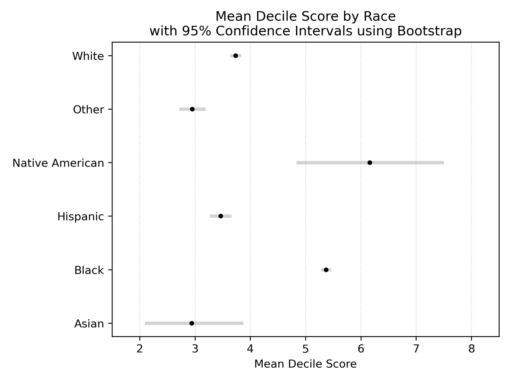
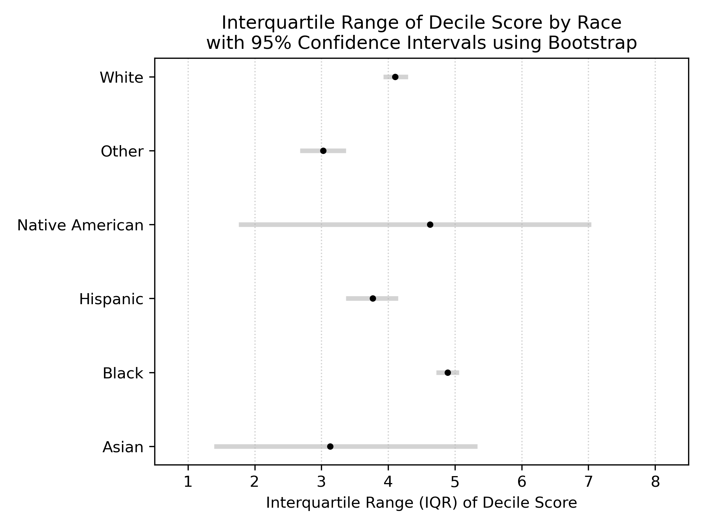

# Algorithmic Fairness in Criminal Justice: The COMPAS Case

The use of algorithmic risk assessment tools in criminal justice has become a focal point in debates about fairness, accountability, and the ethics of artificial intelligence. This project examines the **COMPAS (Correctional Offender Management Profiling for Alternative Sanctions)** recidivism risk assessment algorithm, which has been widely deployed across the United States to inform bail, sentencing, and parole decisions.

As Brian Christian explores in **The Alignment Problem**, ensuring that AI systems align with human values, particularly fairness and equity, is one of the most pressing challenges of our time. The COMPAS algorithm exemplifies this challenge: while designed to improve criminal justice outcomes through data-driven risk prediction, [investigative journalism by ProPublica in 2016](https://www.propublica.org/article/machine-bias-risk-assessments-in-criminal-sentencing) revealed troubling racial disparities in its predictions. Specifically, the algorithm was found to disproportionately misclassify Black defendants as high-risk (false positives) while misclassifying White defendants as low-risk (false negatives).

## 📋 Project Overview
This project analyzes racial disparities in the COMPAS recidivism risk assessment algorithm using statistical methods. Specifically, we use bootstrap resampling to quantify differences in score distributions across racial groups, and permutation testing to formally test whether Black and White defendants experience significantly different false positive rates when classified as high-risk.

Contents:
- `data/` - Datasets published by Pro Publica (see [official GitHub repo](https://github.com/propublica/compas-analysis))
- `eda.ipynb` - Brief examination of potential bias of risk assessment scores in the datasets
- `analysis.ipynb` - Main analysis notebook with fairness metrics and comparisons
- `results/` - Generated visualizations and plots

## 📊 Key Findings

### Mean COMPAS scores across race groups

The bootstrap results show a clear difference in mean COMPAS decile scores across race groups. Black defendants ($5.37 \pm 0.05$) have a substantially higher average score than White defendants ($3.73 \pm 0.05$), with narrow and non-overlapping confidence intervals, reflecting a precise and sizeable difference. This upward shift in the score distribution implies that, for any fixed threshold, Black defendants are more likely to be classified as high risk.



### IQR of COMPAS scores across race groups

The bootstrap estimates indicate that Black defendants ($5.00 \pm 0.01$) have a larger interquartile range of COMPAS decile scores than White defendants ($4.49 \pm 0.50$), suggesting greater dispersion in assigned risk scores. The confidence intervals for Black and White defendants show limited overlap, while intervals for smaller groups are wide due to sample size. Greater score dispersion implies more mass in the upper tail of the score distribution, increasing the likelihood of exceeding a fixed high-risk threshold.



### False Positive Rate Disparity

The permutation test reveals a significant disparity in false positive rates between racial groups. We reject the null hypothesis of no difference ($H_0: \Delta_\mathrm{FPR}\leq0$) with $p\approx0$, far below conventional significance thresholds ($\alpha = 0.05$).

The observed disparity of 0.214 means Black defendants are 21.4 percentage points more likely to be incorrectly classified as high-risk compared to White defendants among those who do not reoffend. This stark difference is extremely unlikely to occur by random chance, indicating systematic racial bias in COMPAS score distributions rather than statistical noise.


## ⚙️ Dependencies
- Python 3.x
- pandas
- numpy
- matplotlib

## 🚀 Usage
Explore the dataset:
```bash
jupyter notebook eda.ipynb
```
Run the analysis:
```bash
jupyter notebook analysis.ipynb
```

## 📚 References
- COMPAS dataset and documentation
- Fairness in machine learning literature